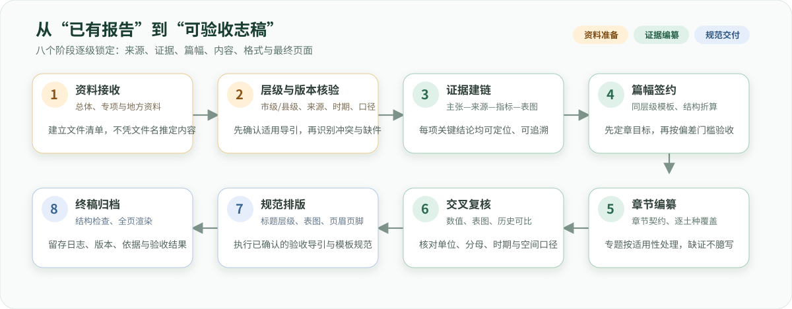

<p align="center">
  
</p>

<p align="center">
  <a href="CHANGELOG.md"></a>
  <a href="https://github.com/SoMic520/soil-city-county-chronicle-skill/actions/workflows/validate.yml"></a>
  <a href="scripts/"></a>
  <a href="scripts/"></a>
  <a href="SKILL.md"></a>
</p>

<p align="center">
  <a href="https://github.com/SoMic520/soil-city-county-chronicle-skill/releases/latest/download/soil-city-county-chronicle-skill.zip"></a>
  <a href="https://github.com/SoMic520/soil-city-county-chronicle-skill/releases/latest/download/soil-city-county-chronicle-workbuddy.zip"></a>
</p>

<p align="center">
  <a href="#安装与验证">安装与验证</a> ·
  <a href="#市县级自动识别">市县级识别</a> ·
  <a href="#完整工作流">完整工作流</a> ·
  <a href="#篇幅契约">篇幅契约</a> ·
  <a href="#质量门槛">质量门槛</a>
</p>

> [!IMPORTANT]
> 这是市县级土壤志编纂工作流，不是自动生成地方事实的工具。地方事实、数值、空间规律、历史变化和建议必须来自可定位的报告、表图或正式确认记录。

## 核心能力

<table width="100%">
  <tr>
    <td width="50%" valign="top"><strong>📚 资料先行</strong><br><sub>盘点总体、工作、类型、属性、数据、退化、耕地质量和适宜性等已有成果；文件名不等于内容已核验。</sub></td>
    <td width="50%" valign="top"><strong>🏛️ 自动识别市县级</strong><br><sub>综合任务文件、适用导引、模板标识和下级汇总特征判定层级；“名称带市”不作为单独判据。</sub></td>
  </tr>
  <tr>
    <td width="50%" valign="top"><strong>🔗 证据可追溯</strong><br><sub>建立“章节—主张—来源—指标—表图”追溯链；证据不足时只阻断受影响表述，不虚构事实。</sub></td>
    <td width="50%" valign="top"><strong>🧱 分层级章节契约</strong><br><sub>市级强调县级成果核验、接边、制图综合和土类—亚类—土属；县级深入亚类—土属—土种与典型剖面。</sub></td>
  </tr>
  <tr>
    <td width="50%" valign="top"><strong>📏 模板驱动篇幅</strong><br><sub>先实测同层级适用模板，再按真实土壤分类单元、指标、评价模块和建议主题折算。</sub></td>
    <td width="50%" valign="top"><strong>📝 验收导引排版</strong><br><sub>严格映射“第一章—一、—（一）—1.—（1）”层级，并分别检查 DOCX 结构和逐页视觉结果。</sub></td>
  </tr>
</table>

## 完整工作流

<p align="center">
  
</p>

## 安装与验证

### 安装前检查

<table width="100%">
  <tr>
    <td width="33%" align="center"><strong>Git</strong><br><sub>用于克隆和更新仓库</sub></td>
    <td width="33%" align="center"><strong>Python 3.9+</strong><br><sub>仅使用标准库，无需 pip 安装依赖</sub></td>
    <td width="34%" align="center"><strong>目标平台</strong><br><sub>Codex、Claude Code 或 WorkBuddy</sub></td>
  </tr>
</table>

```powershell
git --version
python --version
```

### OpenAI Codex

**ZIP 一键安装**

从首页点击“下载通用 Skill ZIP”，解压后将其中的`soil-city-county-chronicle`文件夹放入`~/.codex/skills/`。Windows PowerShell 可直接执行：

```powershell
Expand-Archive ".\soil-city-county-chronicle-skill.zip" -DestinationPath "$env:USERPROFILE\.codex\skills"
```

发布 ZIP 是精简的运行包，不含仓库级`tools/`，因此解压后应使用下列命令验证核心脚本：

```powershell
python -m unittest discover -s "$env:USERPROFILE\.codex\skills\soil-city-county-chronicle\scripts" -p "test_*.py"
```

**Windows PowerShell**

```powershell
$skillDir = Join-Path $env:USERPROFILE ".codex\skills\soil-city-county-chronicle"
git clone https://github.com/SoMic520/soil-city-county-chronicle-skill.git $skillDir
python (Join-Path $skillDir "tools\validate_adapters.py")
```

**macOS / Linux**

```bash
skill_dir="${HOME}/.codex/skills/soil-city-county-chronicle"
git clone https://github.com/SoMic520/soil-city-county-chronicle-skill.git "$skill_dir"
python3 "$skill_dir/tools/validate_adapters.py"
```

安装后新建一个 Codex 任务，并用 `$soil-city-county-chronicle` 显式调用一次。若未发现技能，先确认目标目录中直接存在 `SKILL.md`，且没有多套一层仓库目录。

### Claude Code

```powershell
$skillDir = Join-Path $env:USERPROFILE ".claude\skills\soil-city-county-chronicle"
git clone https://github.com/SoMic520/soil-city-county-chronicle-skill.git $skillDir
python (Join-Path $skillDir "tools\validate_adapters.py")
```

macOS / Linux 将目标目录改为 `${HOME}/.claude/skills/soil-city-county-chronicle`。根目录遵循 Agent Skills 的 `SKILL.md` 结构。

### WorkBuddy Open Platform

```powershell
git clone https://github.com/SoMic520/soil-city-county-chronicle-skill.git
Set-Location soil-city-county-chronicle-skill
python tools/build_workbuddy_adapter.py
python tools/validate_adapters.py
```

可直接点击首页“下载 WorkBuddy ZIP”并在技能管理界面导入；也可从源码仓库导入`platforms/workbuddy/soil-city-county-chronicle`。ZIP 是 GitHub Release 附件，不提交到 Git 源码树。

### 更新已安装版本

```powershell
git -C "$env:USERPROFILE\.codex\skills\soil-city-county-chronicle" pull --ff-only
python "$env:USERPROFILE\.codex\skills\soil-city-county-chronicle\tools\validate_adapters.py"
```

### 首次调用

```text
使用 $soil-city-county-chronicle，先识别项目是市级还是县级，说明判定证据；
再盘点已有三普报告，建立资料、证据和缺口台账，按适用导引与同层级模板确定章节和篇幅，
最后形成可追溯、可复核、按验收标准排版的高质量土壤志。
```

## 市县级自动识别

```powershell
python scripts/level_profile.py detect "任务书.docx" "土壤志模板.docx" --output "层级识别.json"
```

识别器按证据强度判断 `municipal`（市级）、`county`（县级）或 `unknown`（待确认）。地名以“市”结尾可能是地级市，也可能是县级市，因此不会只凭标题后缀判断。冲突或弱证据返回 `unknown`，共享的资料整理可继续，但不会提前锁定层级专属章节、篇幅和排版规则。

<table width="100%">
  <thead><tr><th width="22%">比较项</th><th width="39%">市级土壤志</th><th width="39%">县级土壤志</th></tr></thead>
  <tbody>
    <tr><td><strong>成果来源</strong></td><td>核验并汇总所辖县级成果，处理跨界一致性</td><td>以本级调查、检测、制图、评价和历史资料为主</td></tr>
    <tr><td><strong>空间重点</strong></td><td>县际差异、接边、制图综合、市域分区</td><td>县域内部土壤分布、利用与剖面证据</td></tr>
    <tr><td><strong>第三章主线</strong></td><td>土类 → 亚类 → 土属，土属层面综合记述</td><td>亚类 → 土属 → 土种，土种含典型剖面详述</td></tr>
    <tr><td><strong>配套成果</strong></td><td>市级土种志通常独立成册，避免在土壤志重复展开</td><td>土壤志内按导引逐土种覆盖并给出剖面依据</td></tr>
    <tr><td><strong>建议尺度</strong></td><td>跨县布局、区域协同、全市农业发展与分区治理</td><td>县域耕地保护、具体障碍改良与落地措施</td></tr>
  </tbody>
</table>

完整差异、证据优先级和章节映射见[市县级识别与模板差异](references/levels.md)。

## 平台兼容

<table width="100%">
  <thead><tr><th width="20%">平台</th><th width="36%">安装位置</th><th width="44%">支持方式</th></tr></thead>
  <tbody>
    <tr><td><strong>OpenAI Codex</strong></td><td><code>~/.codex/skills/soil-city-county-chronicle</code></td><td>仓库根目录原生 Skill</td></tr>
    <tr><td><strong>Claude Code</strong></td><td><code>~/.claude/skills/soil-city-county-chronicle</code></td><td>仓库根目录兼容 Agent Skills 开放格式</td></tr>
    <tr><td><strong>WorkBuddy</strong></td><td><code>platforms/workbuddy/soil-city-county-chronicle</code></td><td>官方字段与 <code>references/scripts/templates</code> 专用适配</td></tr>
    <tr><td><strong>其他 Agent Skills 平台</strong></td><td>平台规定的 Skills 目录</td><td>使用仓库根目录，并先确认脚本执行权限</td></tr>
  </tbody>
</table>

完整说明见[平台兼容矩阵](platforms/README.md)。

## 篇幅契约

市县级导引均不以一个全国统一总字数代替内容质量。本 Skill 采用“同层级模板实测＋结构折算＋偏差上限”，默认统计接受修订后的章内叙述正文有效字符数。

<table width="100%">
  <thead><tr><th width="25%">控制对象</th><th width="30%">普通项目门槛</th><th width="45%">控制意图</th></tr></thead>
  <tbody>
    <tr><td><strong>第一、二章目标</strong></td><td align="center"><code>同层级模板对应章 ±15%</code></td><td>保持基础章节与适用模板相近</td></tr>
    <tr><td><strong>第三至六章目标</strong></td><td align="center"><code>结构折算；模板对应章 ±30%</code></td><td>按分类单元、指标和评价模块自适应</td></tr>
    <tr><td><strong>全志目标合计</strong></td><td align="center"><code>模板对应章节合计 ±20%</code></td><td>防止总体篇幅偏离模板过大</td></tr>
    <tr><td><strong>各章终稿实际值</strong></td><td align="center"><code>已锁定章目标 ±15%</code></td><td>约束编纂过程中的章节膨胀或缩水</td></tr>
    <tr><td><strong>终稿实际合计</strong></td><td align="center"><code>总目标 ±10%；模板合计 ±25%</code></td><td>同时校验项目目标与模板参照</td></tr>
  </tbody>
</table>

标题、表格、题注、页眉页脚、附件及删除的修订文字不计入默认篇幅。市级第三章以土属等市级叙述单元折算，县级第三章以土种等县级叙述单元折算；不能混用两个层级的模板基线。详细规则见[篇幅契约](references/length.md)。

```powershell
python scripts/length_profile.py measure-docx "同层级模板.docx"
python scripts/length_profile.py calculate-plan "length-plan.json" --output "待复核计划.json"
python scripts/length_profile.py check-plan "length-plan.json" --final
```

> [!NOTE]
> 土特产专题确属未开展或不适用时，可以依据适用导引省略；仅仅缺少报告，不能把模块数按 0 处理。

## 质量门槛

<table width="100%">
  <tr>
    <td width="20%" align="center"><strong>① 层级门槛</strong><br><sub>市县级与导引匹配</sub></td>
    <td width="20%" align="center"><strong>② 资料门槛</strong><br><sub>来源、版本、缺口可查</sub></td>
    <td width="20%" align="center"><strong>③ 内容门槛</strong><br><sub>章节、分类单元、专题可核</sub></td>
    <td width="20%" align="center"><strong>④ 数值门槛</strong><br><sub>单位、分母、时期一致</sub></td>
    <td width="20%" align="center"><strong>⑤ 版面门槛</strong><br><sub>结构检查＋全页渲染</sub></td>
  </tr>
</table>

```powershell
python scripts/chronicle.py check "D:\项目\市县级土壤志工作台"
python scripts/chronicle.py check "D:\项目\市县级土壤志工作台" --final
python scripts/chronicle.py docx-check "市县级土壤志.docx"
python -m unittest discover -s scripts -p "test_*.py"
```

检查器不会认证台账所填事实，也不能替代目标软件重开、字段更新、全页渲染和专家审查。

## 目录结构

```text
soil-city-county-chronicle-skill/
├─ SKILL.md                         # Skill入口与强制工作流
├─ agents/openai.yaml               # Codex界面元数据
├─ references/levels.md             # 市县级识别、差异与章节映射
├─ references/                      # 资料、证据、写作、篇幅、排版与质量规则
├─ assets/project/                  # 可复制的项目台账与审查模板
├─ scripts/level_profile.py         # 市县级证据识别器
├─ scripts/                         # 初始化、记录、DOCX与篇幅检查
├─ platforms/workbuddy/             # WorkBuddy Open Platform专用适配
├─ tools/                           # 适配构建与跨平台验证
├─ CHANGELOG.md
├─ CONTRIBUTING.md
└─ SECURITY.md
```

## 设计原则

- **资料先行**：优先读取已有成果报告，再提出最小补件。
- **层级先锁定**：市级与县级共用证据原则，不混用章节粒度和模板基线。
- **证据先于成文**：先锁定对象、时期、地类、土层、方法、单位和分母。
- **缺口局部阻断**：缺失只限制受影响的主张和章节，不让整个项目停摆。
- **模板不是事实源**：范文只提供结构和篇幅参照，不提供目标地区数据。
- **排版与内容分开验收**：配置通过、DOCX结构通过和逐页视觉通过是三件事。

## 数据安全

Git 源码树不包含真实市县级数据库、样点坐标、化验数据、GIS成果或项目报告。GitHub Release 提供由脚本确定性构建的纯 Skill ZIP；它不含真实项目数据，也不把 ZIP 提交回源码树。详见[安全说明](SECURITY.md)。

## 标识与项目声明

横幅使用第三次全国土壤普查官方指定标识，保持原有比例、色彩和构图，仅用于说明本工具服务于三普成果编纂。标识权利归国务院第三次全国土壤普查领导小组办公室；本仓库为非官方工具，不表示主管部门背书。使用范围与来源见[标识与权利说明](NOTICE.md)。

## 当前版本

`2026-09-16-r5`：加入市级模板与县级模板差异、层级证据识别、分层级章节与篇幅规则，并重做全宽视觉首页和跨平台安装说明。完整变化见[CHANGELOG](CHANGELOG.md)。
